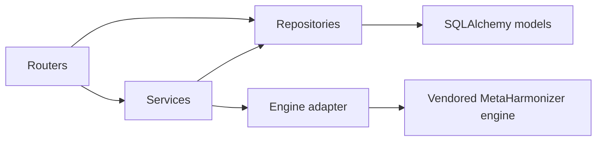
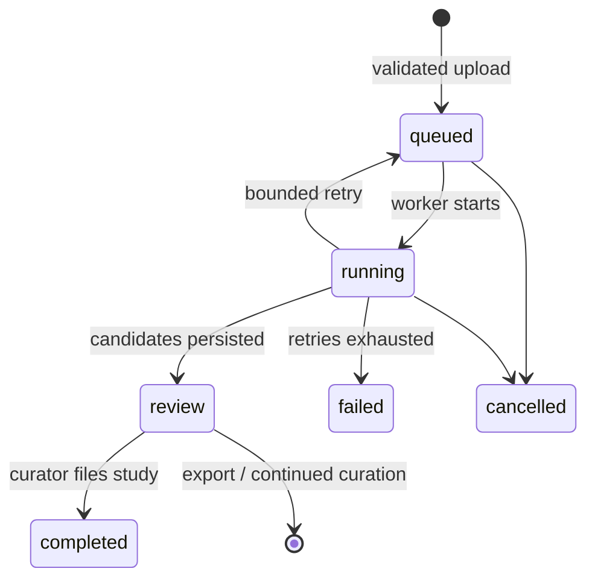

# Architecture

## System context

MetaHarmonizerApp is a human-in-the-loop metadata harmonization system. Curators
upload de-identified tabular metadata, review schema and ontology proposals,
approve corrections, inspect quality, and export standardized datasets. AI
clients may reach the same engine through the optional MCP server, and validated
exports feed cBioPortal-compatible tooling.

**Naming.** *MetaHarmonizerApp* is this repository: the deployable platform
(SPA, API, worker, and datastores). *MetaHarmonizer* is the upstream ML package
[`shbrief/MetaHarmonizer`](https://github.com/shbrief/MetaHarmonizer), vendored
behind the engine adapter. Throughout this document "the engine" means the
latter, never the platform as a whole.

Production currently runs on one host, so PostgreSQL, Redis, Caddy, API, and
worker share a failure domain; horizontal scaling does not by itself create high
availability.

## Trust boundaries

| Boundary | Data crossing it | Controls |
|---|---|---|
| Browser to edge | Credentials, metadata, decisions, exports | TLS, JWT/refresh sessions, RBAC, CSP, rate limits |
| API to PostgreSQL | Users, studies, mappings, audit and job state | Private Compose network, credentials, migrations, ownership filters |
| API/worker to Redis | Queue jobs, progress, rate-limit and activity state | Private Compose network, bounded queue, expirations |
| API/worker to object storage | Uploaded metadata and generated artifacts | Owner-scoped keys, retention, local volume or private S3-compatible backend |
| Runtime to upstream providers | Email, optional LLM, KB build sources | Host-only secrets, explicit optional configuration, offline runtime models |
| Host to backup storage | Encrypted PostgreSQL dump | AES-256-GCM before upload, bucket-scoped credentials, restore drills |

The public deployment currently uses a local persistent volume for study
objects. R2 is dedicated to encrypted PostgreSQL backups. Moving workers to a
second host requires migrating study objects to the existing S3-compatible
storage adapter first.

## Backend ownership

The backend follows explicit dependency direction:

- **Routers** own HTTP/WebSocket transport, authentication dependencies, and
  response contracts.
- **Services** own reusable workflows and domain orchestration.
- **Repositories** are the persistence boundary.
- **Engine adapter** is the only application package allowed to import the
  upstream `metaharmonizer` package. CI enforces this rule.
- **Workers** execute bounded asynchronous tasks and publish progress through
  Redis; durable status remains in PostgreSQL.

Some routers still contain transaction orchestration. This is accepted where
the workflow is short and transport-specific, but new reusable behavior should
move into services rather than expanding router modules further.

## Frontend ownership

- `src/api/` owns typed HTTP calls and response shapes.
- `src/hooks/` owns shared server-state queries and invalidation.
- `src/context/` owns authentication, jobs, notifications, and theme state.
- `src/pages/` composes workflows.
- `src/components/` and `src/components/ui/` own reusable product and visual
  components.

TanStack Query owns server state. Pages should not duplicate remote data in
local state unless editing requires a temporary draft. Global rendering errors
are contained by the application error boundary; page-level API failures must
remain visible and retryable.

## Data and consistency

- PostgreSQL is the source of truth for users, studies, mapping decisions,
  schema versions, ontology snapshots, jobs, and audit history.
- Redis data is operational and reconstructable; it is not the source of truth
  for completed work.
- Study ownership is enforced for reads, mutations, exports, reruns, and
  progress access.
- Schema and ontology versions are stamped onto studies for reproducibility.
- Learned decisions are layered: personal decisions override shared decisions.
- Alembic is the only supported schema-change mechanism.

## Runtime and deployment

The production topology is a single OCI host running Docker Compose. API and
worker share one application image but use different commands. Caddy terminates
TLS and serves the built SPA. One-shot services publish frontend assets, seed
the KB, run backups, and perform operational checks.

This is intentionally portable but not highly available. PostgreSQL, Redis,
Caddy, and the host are single failure domains. The phased path to API replicas,
remote workers, object storage, and replicated state is documented in
[scaling-plan.md](scaling-plan.md).

## Architecture invariants

Changes must preserve these rules:

1. No direct upstream-engine imports outside the adapter.
2. No production data or secrets in source control, logs, tests, or public issues.
3. Every study-scoped operation enforces ownership.
4. Long-running work is queued, bounded, retryable, observable, and idempotent.
5. PostgreSQL changes use migrations with compatibility and rollback analysis.
6. KB/model updates are versioned, integrity checked, benchmarked, and reversible.
7. Operational changes include health verification and a rollback path.

## Harmonization lifecycle

Each study records the schema version and ontology snapshot used to produce its
mappings. Curator decisions are stored separately from the versioned engine KB:
personal decisions override shared decisions, and administrators can promote or
stop sharing decisions without rewriting study history.

## Persistent state

| State | Owner | Notes |
|---|---|---|
| Users, studies, mappings, versions, audit | PostgreSQL | Alembic-managed relational source of truth |
| Queue, rate limits, progress, active-user window | Redis | Recoverable operational state; job rows remain in PostgreSQL |
| Uploaded source and exports | Local volume or S3-compatible storage | Remote workers require shared object storage |
| Engine KB and model cache | Versioned read-only volumes | Bundle SHA is recorded with ontology snapshots |
| TLS certificates | Caddy volume | Renewed automatically |
| Encrypted backups | Dedicated S3/R2 bucket | Host-side AES-256-GCM encryption |

## Security boundaries

- Caddy is the only public network entry point.
- PostgreSQL and Redis are not exposed on host ports in production.
- API and worker run as non-root UID/GID 1000 with `no-new-privileges`.
- JWT sessions and personal API tokens resolve to role-based authorization.
- Uploads are owner-scoped; administrators have operational host/database access
  and must be governed as data operators.
- Prometheus metrics require an admin-scoped token.
- Secrets and encryption keys are host-only and excluded from Git.

## Operations

Systemd adapters run encrypted backups, KB updates, five-minute health checks,
and daily capacity reports. GitHub Actions enforce tests, coverage, dependency
audits, secret scanning, CodeQL, container scans, SBOM generation, non-root
runtime checks, and engine-boundary contracts.

See [production operations](production-operations.md), [service objectives](service-level-objectives.md),
and [scaling](scaling-plan.md).

## Design principles and trade-offs

- **Human authority:** automation ranks and proposes; curator decisions remain explicit.
- **Dependency inversion:** the dashboard depends on `EngineProtocol`, not the
  upstream package.
- **Reproducibility:** schema versions, ontology snapshots, bundle hashes, and
  audit events are persisted.
- **Fail bounded:** queue depth, retries, job timeouts, upload size, rate limits,
  and per-user active jobs are capped.
- **Portable deployment:** behavior is defined through containers, environment
  variables, volumes, and one-shot commands.
- **Honest scaling:** API reads and ML jobs have separate measured limits.

## Known limitations and delegated work

These are deliberate follow-up items, not hidden guarantees:

1. Add external uptime monitoring and retained metrics history; host-local checks
   cannot report when the host itself is unreachable.
2. Move uploads to shared object storage before deploying remote workers.
3. Recalculate aggregate database pools before adding API/worker processes.
4. Add managed or replicated stateful services before claiming high availability.
5. Add mixed dashboard/real-ML load tests after any CPU or worker expansion.
6. Continue raising component-level frontend coverage and decomposing the largest
   review/admin pages as behavior changes require.

## Further architecture material

This document is the current, authoritative description of the deployed system.
The material below adds depth or records why a decision was made.

| Document | What it covers |
|---|---|
| [Architecture review dossier](architecture/README.md) | Source-derived discovery report, layer model, risk register, and diagram index |
| [Engine system design](architecture/engine-system-design.md) | Matching engine, adapter boundary, staged cascade, and knowledge base |
| [Dashboard system design](architecture/dashboard-system-design.md) | API, worker, realtime, auth, and deployment topology of the dashboard |
| [Knowledge base lifecycle](kb-lifecycle.md) | How the KB bundle is built, published, seeded, and refreshed |
| [Scaling plan](scaling-plan.md) | Measured limits and the phased path beyond one host |
| [Production operations](production-operations.md) | Health checks, capacity reports, alerting, and recovery |

**Decision records**

| ADR | Decision |
|---|---|
| [0001](adr/0001-engine-adapter-pattern.md) | Isolate the upstream engine behind one adapter protocol |
| [0002](adr/0002-system-architecture.md) | Modular monolith, single VM, and the chosen infrastructure |
| [0003](adr/0003-two-layer-curation-kb.md) | Two-layer curation knowledge base |
| [0004](adr/0004-locked-decision-review.md) | Review of the locked decisions: what still holds, what is relaxed, what is superseded |

ADRs record the decision at the time it was taken. Where a later choice replaced
an option, this document and the deployment guide are authoritative.

**Diagram sources**

| File | Format |
|---|---|
| [architecture-overview.svg](architecture-overview.svg) | Rendered system overview used above and in the README |
| [system-overview.svg](architecture/system-overview.svg) | Detailed component and stack map |
| [architecture.d2](architecture/architecture.d2) | D2 source for the full system diagram |
| [architecture.drawio](architecture/architecture.drawio) | Editable draw.io diagram |
| [workspace.dsl](architecture/workspace.dsl) | Structurizr C4 model |
